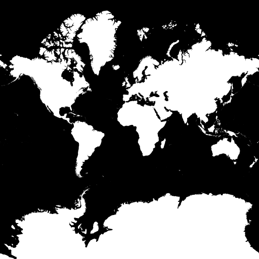

# Introduction to Data Visualization and Maps
Taught by Alan McConchie at Localgroup Studio

This document: https://github.com/localgroupbham/dataviz-and-maps

Wifi: 221prospect password: prospect

# Outline:

1 pm — **Part 1: Introduction to web mapping concepts**

2 pm — **Part 2: Visualizing geographic data with CARTO.com**

3 pm — 20 minute break

3:30 pm — **Part 3: Working with tiles and data in Leaflet**

4 pm — **Part 4: Applying D3.js to maps**

5 pm — Conclusion of class

# Part 1: Introduction to web mapping concepts

As [before](https://github.com/localgroupbham/intro-to-dataviz), this class will also be heavily directly by your interests and questions. After the class I'll flesh out this document (https://github.com/localgroupbham/dataviz-and-maps) with more notes and links that we discussed today.

## An overview of the state of the art
Some [maps we've made at Stamen](http://stamen.com/maps/), and maps we love made by others. What tools did these maps use? Where did the data come from? How and _why_ were they designed this way?

## Servers and clients, rasters and vectors

See: [Anatomy of a web map](http://maptime.io/anatomy-of-a-web-map/)

To understand the fundamentals of tiled web maps, we'll look at some very basic Leaflet maps (you don't need to fully understand the code quite yet)

- [Leaflet starter](http://blockbuilder.org/almccon/6d632572739217d2804fd2d429b9fa23)
- [Leaflet starter (with a Toner basemap)](http://bl.ocks.org/almccon/48ad757db4c4be5fee5cf046df0d94bc)
- [Leaflet starter with GeoJSON overlay](http://bl.ocks.org/almccon/89c3b7da30f8686d3777fdeb65d73250)

For contrast, here are a few basic D3.js maps:

- [D3 map demo](http://bl.ocks.org/almccon/6ab03506d2e3ff9d843f69fa2d5c29cf)
- [D3 map using Winkel Tripel projection](http://bl.ocks.org/almccon/7cba55415b3bc19e1f383043746756f2)

And here are two places you can find open-source data. These provide the data foundation for most of the maps we'll be seeing today:

* [Natural Earth](http://naturalearthdata.com)
* [OpenStreetMap](http://openstreetmap.org)

# Part 2: Visualizing geographic data with CARTO.com

Before we get started with this section, create an account on [CARTO](http://carto.com) (a user-friendly online mapping platform, formerly known as CartoDB). For desktop mapping, try [QGIS](http://qgis.org).

CARTO is a good tool for data _exploration_, and it's also good for processing your data when you transition to data _presentation_.

As with non-spatial data visualization, choose your data wisely. Clean it throughly. Remove what you don't need! In general, pre-process your data with the end product in mind.

Let's load some data in CARTO, try the web editor to draw features, edit them, etc. Note, you can get lots of interesting datasets to start with from CARTO's [Data Library](https://carto.com/data-library)

Look at the SQL view, and if you're familiar with SQL you can do a lot to transform your data really easily! Let's try extracting just a few features.

# Part 3: Working with tiles and data in Leaflet

[Leaflet](http://leafletjs.com/) is a Javascript library for displaying maps using map tiles.  

Compare these two blocks, and try changing the map tile provider:

- [Leaflet starter](http://blockbuilder.org/almccon/6d632572739217d2804fd2d429b9fa23)
- [Leaflet starter (with a Toner basemap)](http://bl.ocks.org/almccon/48ad757db4c4be5fee5cf046df0d94bc)

Here's a Leaflet plugin that lets you pick different tile providers, but mainly I just use it for browsing different options: [Leaflet providers preview](https://leaflet-extras.github.io/leaflet-providers/preview/)

And before we leave the world of Leaflet, let's talk about map tiles again. Why do they use the Mercator projection? Let's start with the [zoom 0 tile:](http://maps.stamen.com/toner/#0/0/0)

Mercator is a necessary evil for tiled web maps. Unless you're using tiles, you probably shouldn't use Mercator. Have you learned to hate Mercator yet?

["Why are we changing maps?"](https://www.youtube.com/watch?v=vVX-PrBRtTY) (note, _don't_ use the Peters projection either!)

# Part 4: Applying D3.js to maps

Start with this basic map, using a Robinson projection:

* [http://bl.ocks.org/almccon/dc1acd0b5d33c18c706f2d1e3ec5f3eb](http://bl.ocks.org/almccon/dc1acd0b5d33c18c706f2d1e3ec5f3eb)

Let's try switching the projection, adding another GeoJSON layer, adding mouse interactions, and more. We might end up with something like this:

* [http://bl.ocks.org/almccon/a53831a573911d0a875821c5f9fac6be](http://bl.ocks.org/almccon/a53831a573911d0a875821c5f9fac6be)

If there's time, we can move on to choropleths:

* [https://bl.ocks.org/almccon/9c6502bdf30d5a2c8675235452e9178f](https://bl.ocks.org/almccon/9c6502bdf30d5a2c8675235452e9178f)

# Conclusion: advanced concepts

## Color

Sorry, for election maps you kinda have to choose the awful blue-purple-red colors. It's the law. But for any other kind of map, please choose something better.

Who doesn't love ColorBrewer? But have you really spent some quality time [at the source?](http://colorbrewer2.org/)

Rainbow color ramps [considered harmful](https://eagereyes.org/basics/rainbow-color-map), please don't use them!

And of course you want to be color-blind friendly, so can we recommend [Color Oracle](http://colororacle.org/)?

## Designing with big(-ish) data

* [Heatmaps](http://leaflet.github.io/Leaflet.heat/demo/): people either love them or hate them. They are usually _not_ normalized (that's kind of the point).

* Hexbins are another trendy way to deal with large numbers of points. Here's an example mapping [social media usage in California parks](https://stamen.cartodb.com/u/stamen-org/viz/9499c9a6-80cd-11e4-9e9b-f23c91504230/public_map)

* Adjusting layer opacity and blending styles can create powerful effects, as in [Trees, Cabs, Crime](http://maps.stamen.com/trees-cabs-crime) or our climate change maps for the [Audubon Society](http://stamen.com/work/audubon-society-climate-maps/)

## Linked views: combining maps with other charts

* Examples from American Panorama
  * [Forced Migration](http://dsl.richmond.edu/panorama/forcedmigration)
  * [Foreign Born](http://dsl.richmond.edu/panorama/foreignborn)
  * [The Panorama toolkit](http://github.com/americanpanorama/panorama)
 
 
## Some closing thoughts, pet peeves, and Stamen's map checklist

* [http://content.stamen.com/stamens-checklist-for-maps](http://content.stamen.com/stamens-checklist-for-maps)